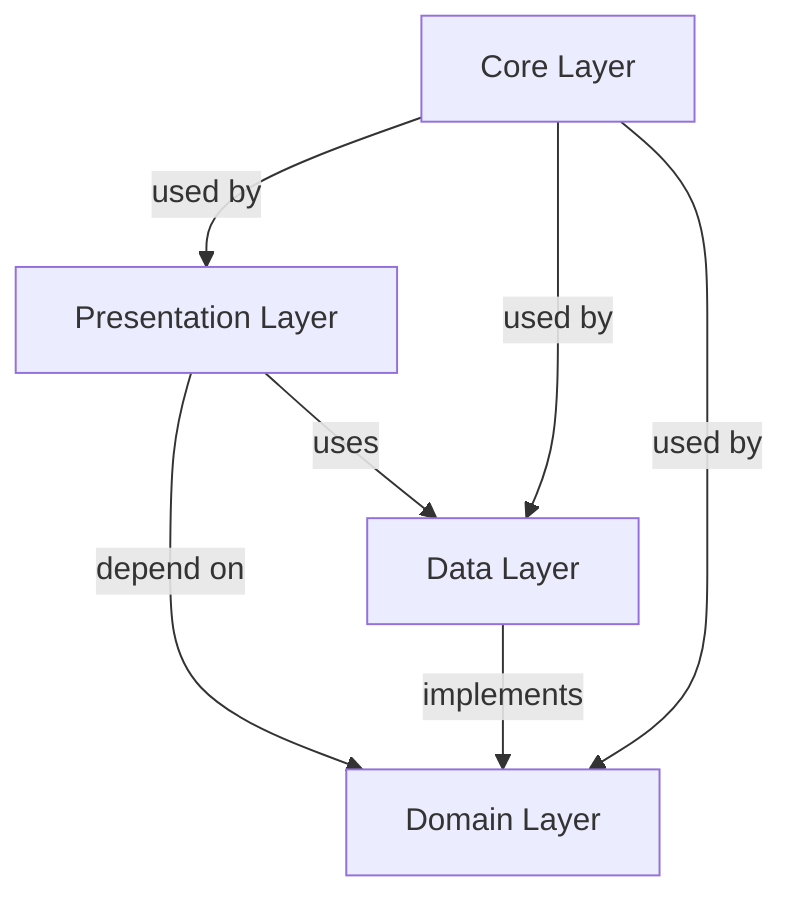

# Architecture du Projet ScoutPresence

Ce document décrit l'architecture Clean Architecture utilisée dans le projet ScoutPresence.

> **Note :** Le projet utilise le package [Lainisha](https://pub.dev/packages/lainisha) pour les fonctionnalités d'administration, fournissant un framework admin cross-platform avec support Material 3.

## Vue d'ensemble

ScoutPresence suit les principes de Clean Architecture pour garantir :
- **Séparation des responsabilités** : Chaque couche a un rôle bien défini
- **Indépendance** : Les couches internes ne dépendent pas des couches externes
- **Testabilité** : Chaque composant peut être testé indépendamment
- **Maintenabilité** : Code organisé et facile à faire évoluer

## Structure en Couches

```
┌─────────────────────────────────────────┐
│         Presentation Layer              │
│  (Screens, Widgets, Providers, Theme)  │
└──────────────┬──────────────────────────┘
               │
┌──────────────▼──────────────────────────┐
│            Domain Layer                 │
│  (Entities, Use Cases, Repositories)   │
└──────────────┬──────────────────────────┘
               │
┌──────────────▼──────────────────────────┐
│             Data Layer                  │
│  (Models, DataSources, Repository Impl) │
└─────────────────────────────────────────┘
```

## Couches de l'Architecture

### 1. Domain Layer (Couche Métier)

La couche la plus interne, indépendante de toute technologie externe.

#### Entités (Entities)
Représentent les objets métier purs, sans dépendances externes.

- `Member` : Représente un membre (scout)
- `Attendance` : Représente une session de présence
- `Branch` : Représente une branche scoute
- `Unit` : Représente une unité
- `Group` : Représente un groupe scout
- `User` : Représente un utilisateur (chef)

#### Repositories (Interfaces)
Définissent les contrats pour l'accès aux données, sans implémentation.

- `MemberRepository` : Interface pour la gestion des membres
- `AttendanceRepository` : Interface pour la gestion des présences
- `BranchRepository` : Interface pour la gestion des branches
- `AuthRepository` : Interface pour l'authentification

#### Use Cases
Contiennent la logique métier spécifique à chaque opération.

**Membres :**
- `GetMembersByBranch` : Récupérer les membres d'une branche
- `CreateMember` : Créer un nouveau membre
- `UpdateMember` : Mettre à jour un membre
- `DeleteMember` : Supprimer un membre

**Présences :**
- `GetAttendanceSessions` : Récupérer les sessions de présence
- `CreateAttendanceSession` : Créer une nouvelle session
- `MarkAttendance` : Marquer la présence d'un membre
- `SyncAttendance` : Synchroniser les présences

**Authentification :**
- `Login` : Connecter un utilisateur
- `Logout` : Déconnecter un utilisateur
- `GetCurrentUser` : Récupérer l'utilisateur actuel

### 2. Data Layer (Couche Données)

Implémente les interfaces définies dans la couche Domain.

#### Models
Étendent les entités et ajoutent la sérialisation JSON pour Firestore.

- `MemberModel extends Member`
- `AttendanceModel extends Attendance`
- `BranchModel extends Branch`
- etc.

#### DataSources

**Local (Drift Database) :**
- `MemberLocalDataSource` : Opérations locales sur les membres
- `AttendanceLocalDataSource` : Opérations locales sur les présences

**Remote (Firebase Firestore) :**
- `MemberRemoteDataSource` : Opérations distantes sur les membres
- `AttendanceRemoteDataSource` : Opérations distantes sur les présences
- `FirebaseService` : Service centralisé pour Firebase

#### Repository Implementations
Orchestrent les sources de données locales et distantes.

- `MemberRepositoryImpl` : Implémentation avec synchronisation offline-first
- `AttendanceRepositoryImpl` : Implémentation avec synchronisation offline-first
- `BranchRepositoryImpl` : Implémentation pour les branches
- `AuthRepositoryImpl` : Implémentation avec Firebase Auth

### 3. Presentation Layer (Couche Présentation)

Interface utilisateur utilisant le pattern MVP (Model-View-Presenter).

#### Providers (State Management)
Gèrent l'état de l'application avec Provider.

- `MemberProvider` : État des membres
- `AttendanceProvider` : État des présences
- `BranchProvider` : État des branches
- `AuthProvider` : État d'authentification
- `AdminProvider` : État de l'administration

#### Screens
Écrans organisés par fonctionnalité.

**Authentification :**
- `LoginScreen` : Écran de connexion
- `SplashScreen` : Écran de démarrage

**Membres :**
- `MembersListScreen` : Liste des membres
- `MemberDetailScreen` : Détails d'un membre
- `MemberFormScreen` : Formulaire création/édition
- `MemberMedicalInfoScreen` : Informations médicales

**Présences :**
- `AttendanceListScreen` : Liste des sessions
- `AttendanceSessionScreen` : Pointage de présence
- `CreateSessionScreen` : Création de session

**Accueil :**
- `HomeScreen` : Écran d'accueil

**Administration :**
- `AdminDashboardScreen` : Tableau de bord d'administration
- `UserManagementScreen` : Gestion des utilisateurs

#### Widgets
Composants réutilisables organisés par domaine.

**Commun :**
- `CustomAppBar` : AppBar personnalisée
- `LoadingWidget` : Indicateur de chargement
- `ErrorDisplayWidget` : Affichage d'erreur

**Membres :**
- `MemberCard` : Carte membre
- `MemberListItem` : Élément de liste membre

**Présences :**
- `AttendanceToggle` : Toggle présence/absence
- `SessionCard` : Carte session

#### Theme
Configuration du thème et styles.

- `AppTheme` : Configuration ThemeData (light/dark)
- `AppColors` : Palette de couleurs (branches)
- `AppTextStyles` : Styles de texte

### 4. Core Layer (Couche Transversale)

Code partagé utilisé par toutes les couches.

#### Constants
- `AppConstants` : Constantes globales (couleurs branches, âges)
- `DatabaseConstants` : Noms de collections, clés

#### Errors
- `Exceptions` : Exceptions personnalisées
- `Failures` : Classes Failure pour la gestion d'erreurs

#### Network
- `NetworkInfo` : Vérification de la connectivité

#### Utils
- `Validators` : Validateurs de formulaires
- `DateFormatter` : Formatage de dates

#### Extensions
- `StringExtensions` : Extensions pour les chaînes

## Flux de Données

### Flux Standard (Lecture)

```
Presentation → Use Case → Repository → DataSource → Firebase/Drift
     ↑                                                       │
     └───────────────────────────────────────────────────────┘
```

1. L'utilisateur interagit avec l'interface (Presentation)
2. Le Provider appelle un Use Case (Domain)
3. Le Use Case appelle le Repository (Domain interface)
4. Le Repository Implementation (Data) décide de la source :
   - Si connecté : Remote DataSource (Firebase)
   - Si déconnecté : Local DataSource (Drift)
5. Les données remontent sous forme d'Entity (Domain)
6. Le Provider met à jour l'état
7. L'interface se met à jour

### Flux Offline-First (Écriture)

```
Presentation → Use Case → Repository → Local DataSource (Drift)
                                    ↓
                            (Si connecté)
                                    ↓
                            Remote DataSource (Firebase)
```

1. Les données sont **toujours** sauvegardées localement d'abord
2. Si connecté, synchronisation avec Firebase en arrière-plan
3. Les données sont disponibles immédiatement, même offline

### Synchronisation (RealtimeSyncService)

Le service de synchronisation `RealtimeSyncService` implémente une synchronisation bidirectionnelle en temps réel :

**Firestore → Local :**
```
Firestore Change → Stream Listener → Update Local (Drift)
```

**Local → Firestore :**
```
Timer (30s) → Check Unsynced Data → Upload to Firestore
```

**Résolution de conflits :**
```
Compare lastSync timestamps → Last-Write-Wins → Update Both
```

**Note :** Ce service remplace l'ancien `SyncService` et est initialisé dans `main.dart`.

## Stratégie Offline-First

### Principe
L'application fonctionne d'abord en local, puis synchronise avec le cloud.

### Avantages
- ✅ Fonctionnement garanti même sans internet
- ✅ Réactivité immédiate (pas d'attente réseau)
- ✅ Pas de perte de données
- ✅ Expérience utilisateur fluide

### Implémentation

1. **Stockage Local (Drift Database)**
   - **Mobile/Desktop** : SQLite via Drift Database 2.30.0
   - **Web** : Firebase uniquement (pas de stockage local)
   - Toutes les opérations CRUD fonctionnent localement
   - Données disponibles instantanément

2. **Synchronisation (RealtimeSyncService)**
   - **Firestore → Local** : Écoute des changements Firestore en temps réel
   - **Local → Firestore** : Synchronisation périodique des données non synchronisées (toutes les 30 secondes)
   - Automatique dès reconnexion
   - Détection des modifications locales non synchronisées (`lastSync == null`)
   - Résolution de conflits : Last-Write-Wins (dernière écriture gagne)

3. **Gestion des Conflits**
   - Timestamp de dernière modification (`lastSync`)
   - Identifiant unique par enregistrement
   - Stratégie Last-Write-Wins (comparaison des timestamps)

**Note :** Les branches sont codées en dur dans `core/data/default_branches.dart` et ne sont pas synchronisées depuis Firestore.

## Patterns Utilisés

### 1. Repository Pattern
Abstraction de l'accès aux données, permettant de changer de source sans modifier le code métier.

### 2. Use Case Pattern
Encapsule une action métier spécifique, testable indépendamment.

### 3. MVP Pattern (Model-View-Presenter)
- **Model** : Domain Layer (Entities, Use Cases)
- **View** : Presentation Layer (Screens, Widgets)
- **Presenter** : Providers (State Management)

### 4. Dependency Injection
Les dépendances sont injectées via les constructeurs, facilitant les tests et la maintenance.

## Guide de Contribution

### Ajouter une Nouvelle Fonctionnalité

1. **Domain Layer**
   - Créer l'entité si nécessaire (`domain/entities/`)
   - Créer l'interface du repository (`domain/repositories/`)
   - Créer les use cases (`domain/usecases/`)

2. **Data Layer**
   - Créer le modèle (`data/models/`)
   - Créer les datasources (local et remote) (`data/datasources/`)
   - Implémenter le repository (`data/repositories/`)

3. **Presentation Layer**
   - Créer le provider (`presentation/providers/`)
   - Créer les écrans (`presentation/screens/`)
   - Créer les widgets spécifiques si nécessaire (`presentation/widgets/`)

### Bonnes Pratiques

- ✅ Toujours commencer par la couche Domain (logique métier pure)
- ✅ Ne jamais importer des fichiers de couches externes dans les couches internes
- ✅ Utiliser les interfaces (repositories) plutôt que les implémentations
- ✅ Écrire des use cases simples et focalisés
- ✅ Gérer les erreurs avec Either (dartz) ou Result
- ✅ Tester chaque couche indépendamment

### Tests

- **Unit Tests** : Domain et Data layers
- **Widget Tests** : Presentation widgets
- **Integration Tests** : Flux complets end-to-end

## Diagramme de Dépendances



## Résumé

Cette architecture Clean Architecture garantit :

- **Maintenabilité** : Code organisé et modulaire
- **Testabilité** : Chaque composant testable indépendamment
- **Scalabilité** : Facile d'ajouter de nouvelles fonctionnalités
- **Flexibilité** : Possibilité de changer de technologies (ex: Firebase → autre backend)
- **Séparation des responsabilités** : Chaque couche a un rôle clair

Pour toute question sur l'architecture, veuillez consulter ce document ou ouvrir une issue.

